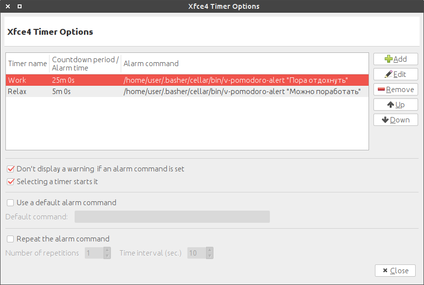

# v-pomodoro-alert

> Pomodoro alert

```shell
v-pomodoro-alert "Work"
```

## Install
Download [`libexec/v-pomodoro-alert`](libexec/v-pomodoro-alert) to `~/.local/bin/`

## Install with [basher](https://github.com/basherpm/basher)
```shell
basher install vovanr/v-pomodoro-alert
```

## Use with Xubuntu
Install `xfce4-timer-plugin`




## License
MIT © [Vladimir Rodkin](https://github.com/VovanR)
